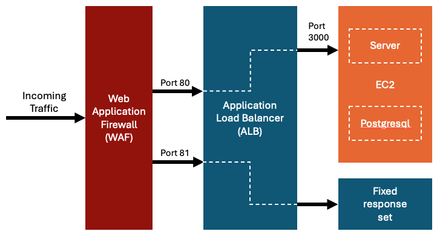

## SC4013 Application Security

### Introduction
- This repo contains code for NTU SC4013 Project, which involves the development and testing of WAF rules.

### Intended Setup Architecture

- The entire architecture is built on AWS.
- The repo contains vulnerable server code which is supposed run on an EC2 instance, together with a Postgresql instance.
- The ALB will route traffic to the EC2 instance, with the WAF standing in front of the ALB.

### Rules

- The image above shows the WAF rules created

### Testing
- There are 2 tests written in the `test` directory: `correctness.test.js` and `performance.test.js`
- `correctness.test.js`: tests for the correctness of the WAF rules
- `performance.test.js`: tests for the performance impact of the 
- To run the tests, run the `npm run test <file>` command
- Make sure to add the ips to the .env file in the test directory

### Documentation
- Additional documentation can be found in the report written for this project